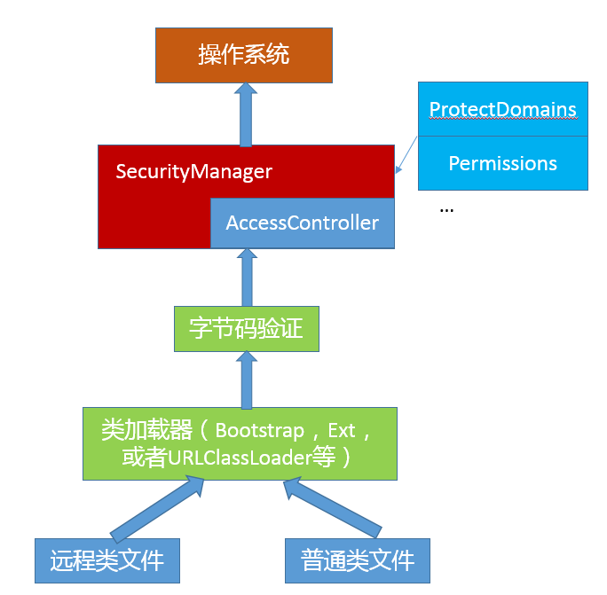

# 第31讲 | 你了解Java应用开发中的注入攻击吗

安全是软件开发领域永远的主题之一，随着新技术浪潮的兴起，安全的重要性愈发凸显出来，对于金融等行业，甚至可以说安全是企业的生命线。不论是移动设备、普通 PC、小型机，还是大规模分布式系统，以及各种主流操作系统，Java 作为软件开发的基础平台之一，可以说是无处不在，自然也就成为安全攻击的首要目标之一。

今天我要问你的问题是，你了解 Java 应用开发中的注入攻击吗？

## 典型回答

注入式（Inject）攻击是一类非常常见的攻击方式，其基本特征是程序允许攻击者将不可信的动态内容注入到程序中，并将其执行，这就可能完全改变最初预计的执行过程，产生恶意效果。

下面是几种主要的注入式攻击途径，原则上提供动态执行能力的语言特性，都需要提防发生注入攻击的可能。

首先，就是最常见的 SQL 注入攻击。一个典型的场景就是 Web 系统的用户登录功能，根据用户输入的用户名和密码，我们需要去后端数据库核实信息。

假设应用逻辑是，后端程序利用界面输入动态生成类似下面的 SQL，然后让 JDBC 执行。

```sql
Select * from use_info where username = “input_usr_name” and password = “input_pwd”
```

但是，如果我输入的 input_pwd 是类似下面的文本，

``` java
“ or “”=”
```

那么，拼接出的 SQL 字符串就变成了下面的条件，OR 的存在导致输入什么名字都是复合条件的。

``` sql
Select * from use_info where username = “input_usr_name” and password = “” or “” = “”
```

这里只是举个简单的例子，它是利用了期望输入和可能输入之间的偏差。上面例子中，期望用户输入一个数值，但实际输入的则是 SQL 语句片段。类似场景可以利用注入的不同 SQL 语句，进行各种不同目的的攻击，甚至还可以加上“;delete xxx”之类语句，如果数据库权限控制不合理，攻击效果就可能是灾难性的。

第二，操作系统命令注入。Java 语言提供了类似 Runtime.exec(…) 的 API，可以用来执行特定命令，假设我们构建了一个应用，以输入文本作为参数，执行下面的命令：

``` java
ls –la input_file_name
```

但是如果用户输入是 “input_file_name;rm –rf /*”，这就有可能出现问题了。当然，这只是个举例，Java 标准类库本身进行了非常多的改进，所以类似这种编程错误，未必可以真的完成攻击，但其反映的一类场景是真实存在的。

第三，XML 注入攻击。Java 核心类库提供了全面的 XML 处理、转换等各种 API，而 XML 自身是可以包含动态内容的，例如 XPATH，如果使用不当，可能导致访问恶意内容。还有类似 LDAP 等允许动态内容的协议，都是可能利用特定命令，构造注入式攻击的，包括 XSS（Cross-site Scripting）攻击，虽然并不和 Java 直接相关，但也可能在 JSP 等动态页面中发生。

## 考点分析

今天的问题是安全领域的入门题目，我简单介绍了最常见的几种注入场景作为示例。安全本身是个非常大的主题，在面试中，面试官可能会考察安全问题，但如果不是特定安全专家岗位，了解基础的安全实践就可以满足要求了。

Java 工程师未必都要成为安全专家，但了解基础的安全领域常识，有利于发现和规避日常开发中的风险。今天我会侧重和 Java 开发相关的安全内容，希望可以起到一个抛砖引玉的作用，让你对 Java 开发安全领域有个整体印象。

+ 谈到 Java 应用安全，主要涉及哪些安全机制？
+ 到底什么是安全漏洞？对于前面提到的 SQL 注入等典型攻击，我们在开发中怎么避免？

## 知识扩展

首先，一起来看看哪些 Java API 和工具构成了 Java 安全基础。很多方面我在专栏前面的讲解中已经有所涉及，可以简单归为三个主要组成部分：

第一，运行时安全机制。可以简单认为，就是限制 Java 运行时的行为，不要做越权或者不靠谱的事情，具体来看：

+ 在类加载过程中，进行字节码验证，以防止不合规的代码影响 JVM 运行或者载入其他恶意代码。
+ 类加载器本身也可以对代码之间进行隔离，例如，应用无法获取启动类加载器（Bootstrap Class-Loader）对象实例，不同的类加载器也可以起到容器的作用，隔离模块之间不必要的可见性等。目前，Java Applet、RMI 等特性已经或逐渐退出历史舞台，类加载等机制总体上反倒在不断简化。
+ 利用 SecurityManger 机制和相关的组件，限制代码的运行时行为能力，其中，你可以定制 policy 文件和各种粒度的权限定义，限制代码的作用域和权限，例如对文件系统的操作权限，或者监听某个网络端口的权限等。我画了一个简单的示意图，对运行时安全的不同层次进行了整理。



可以看到，Java 的安全模型是以代码为中心的，贯穿了从类加载，如 URLClassLoader 加载网络上的 Java 类等，到应用程序运行时权限检查等全过程。

+ 另外，从原则上来说，Java 的 GC 等资源回收管理机制，都可以看作是运行时安全的一部分，如果相应机制失效，就会导致 JVM 出现 OOM 等错误，可看作是另类的拒绝服务。

第二，Java 提供的安全框架 API，这是构建安全通信等应用的基础。例如：

+ 加密、解密 API。
+ 授权、鉴权 API。
+ 安全通信相关的类库，比如基本 HTTPS 通信协议相关标准实现，如TLS 1.3；或者附属的类似证书撤销状态判断（OSCP）等协议实现。

注意，这一部分 API 内部实现是和厂商相关的，不同 JDK 厂商往往会定制自己的加密算法实现。

第三， 就是 JDK 集成的各种安全工具，例如：

+ keytool，这是个强大的工具，可以管理安全场景中不可或缺的秘钥、证书等，并且可以管理 Java 程序使用的 keystore 文件。
+ jarsigner，用于对 jar 文件进行签名或者验证。

在应用实践中，如果对安全要求非常高，建议打开 SecurityManager，

``` java
-Djava.security.manager
```

请注意其开销，通常只要开启 SecurityManager，就会导致 10% ~ 15% 的性能下降，在 JDK 9 以后，这个开销有所改善。

理解了基础 Java 安全机制，接下来我们来一起探讨安全漏洞（Vulnerability）。

按照传统的定义，任何可以用来绕过系统安全策略限制的程序瑕疵，都可以算作安全漏洞。具体原因可能非常多，设计或实现中的疏漏、配置错误等，任何不慎都有可能导致安全漏洞出现，例如恶意代码绕过了 Java 沙箱的限制，获取了特权等。如果你想了解更多安全漏洞的信息，可以从通用安全漏洞库（CVE）等途径获取，了解安全漏洞评价标准。

但是，要达到攻击的目的，未必都需要绕过权限限制。比如利用哈希碰撞发起拒绝服务攻击（DOS，Denial-Of-Service attack），常见的场景是，攻击者可以事先构造大量相同哈希值的数据，然后以 JSON 数据的形式发送给服务器端，服务器端在将其构建成为 Java 对象过程中，通常以 Hastable 或 HashMap 等形式存储，哈希碰撞将导致哈希表发生严重退化，算法复杂度可能上升一个数量级（HashMap 后续进行了改进，我在专栏第 9 讲介绍了树化机制），进而耗费大量 CPU 资源。

像这种攻击方式，无关于权限，可以看作是程序实现的瑕疵，给了攻击者以低成本进行进攻的机会。

我在开头提到的各种注入式攻击，可以有不同角度、不同层面的解决方法，例如针对 SQL 注入：

+ 在数据输入阶段，填补期望输入和可能输入之间的鸿沟。可以进行输入校验，限定什么类型的输入是合法的，例如，不允许输入标点符号等特殊字符，或者特定结构的输入。
+ 在 Java 应用进行数据库访问时，如果不用完全动态的 SQL，而是利用 PreparedStatement，可以有效防范 SQL 注入。不管是 SQL 注入，还是 OS 命令注入，程序利用字符串拼接生成运行逻辑都是个可能的风险点！
+ 在数据库层面，如果对查询、修改等权限进行了合理限制，就可以在一定程度上避免被注入删除等高破坏性的代码。

在安全领域，有一句准则：安全倾向于 “明显没有漏洞”，而不是“没有明显漏洞”。所以，为了更加安全可靠的服务，我们最好是采取整体性的安全设计和综合性的防范手段，而不是头痛医头、脚痛医脚的修修补补，更不能心存侥幸。

一个比较普适的建议是，尽量使用较新版本的 JDK，并使用推荐的安全机制和标准。如果你有看过 JDK release notes，例如8u141，你会发现 JDK 更新会修复已知的安全漏洞，并且会对安全机制等进行增强。但现实情况是，相当一部分应用还在使用很古老的不安全版本 JDK 进行开发，并且很多信息处理的也很随意，或者通过明文传输、存储，这些都存在暴露安全隐患的可能。

今天我首先介绍了典型的注入攻击，然后整理了 Java 内部的安全机制，并探讨了到底什么是安全漏洞和典型的表现形式，以及如何防范 SQL 注入攻击等，希望对你有所帮助。

## 一课一练

关于今天我们讨论的题目你做到心中有数了吗？今天的思考题是，你知道 Man-In-The-Middle（MITM）攻击吗？有哪些常见的表现形式？如何防范呢？
