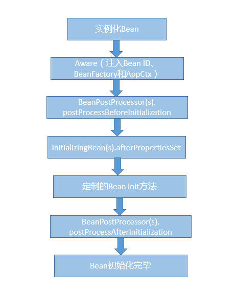
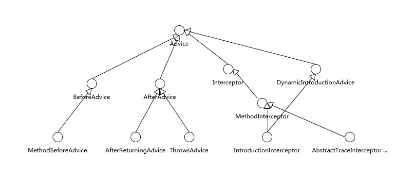
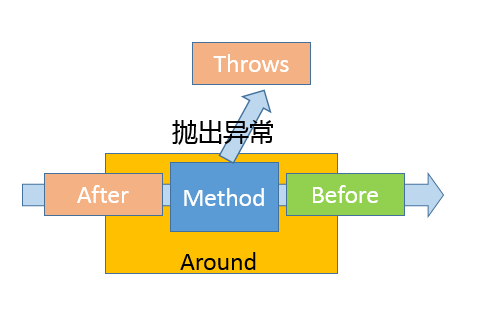
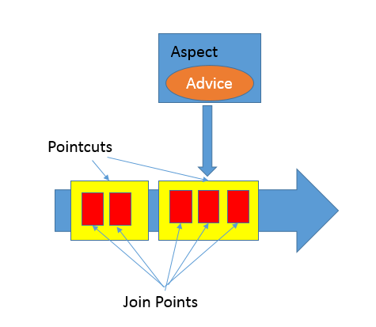

# 第37讲 | 谈谈Spring Bean的生命周期和作用域

在企业应用软件开发中，Java 是毫无争议的主流语言，开放的 Java EE 规范和强大的开源框架功不可没，其中 Spring 毫无疑问已经成为企业软件开发的事实标准之一。今天这一讲，我将补充 Spring 相关的典型面试问题，并谈谈其部分设计细节。

今天我要问你的问题是，谈谈 Spring Bean 的生命周期和作用域？

## 典型回答

Spring Bean 生命周期比较复杂，可以分为创建和销毁两个过程。

首先，创建 Bean 会经过一系列的步骤，主要包括：

+ 实例化 Bean 对象。
+ 设置 Bean 属性。
+ 如果我们通过各种 Aware 接口声明了依赖关系，则会注入 Bean 对容器基础设施层面的依赖。具体包括 BeanNameAware、BeanFactoryAware 和 ApplicationContextAware，分别会注入 Bean ID、Bean Factory 或者 ApplicationContext。
+ 调用 BeanPostProcessor 的前置初始化方法 postProcessBeforeInitialization。
+ 如果实现了 InitializingBean 接口，则会调用 afterPropertiesSet 方法。
+ 调用 Bean 自身定义的 init 方法。
+ 调用 BeanPostProcessor 的后置初始化方法 postProcessAfterInitialization。
+ 创建过程完毕。

你可以参考下面示意图理解这个具体过程和先后顺序。

第二，Spring Bean 的销毁过程会依次调用 DisposableBean 的 destroy 方法和 Bean 自身定制的 destroy 方法。

Spring Bean 有五个作用域，其中最基础的有下面两种：

+ Singleton，这是 Spring 的默认作用域，也就是为每个 IOC 容器创建唯一的一个 Bean 实例。
+ Prototype，针对每个 getBean 请求，容器都会单独创建一个 Bean 实例。

从 Bean 的特点来看，Prototype 适合有状态的 Bean，而 Singleton 则更适合无状态的情况。另外，使用 Prototype 作用域需要经过仔细思考，毕竟频繁创建和销毁 Bean 是有明显开销的。

如果是 Web 容器，则支持另外三种作用域：

+ Request，为每个 HTTP 请求创建单独的 Bean 实例。
+ Session，很显然 Bean 实例的作用域是 Session 范围。
+ GlobalSession，用于 Portlet 容器，因为每个 Portlet 有单独的 Session，GlobalSession 提供一个全局性的 HTTP Session。

## 考点分析

今天我选取的是一个入门性质的高频 Spring 面试题目，我认为相比于记忆题目典型回答里的细节步骤，理解和思考 Bean 生命周期所体现出来的 Spring 设计和机制更有意义。

你能看到，Bean 的生命周期是完全被容器所管理的，从属性设置到各种依赖关系，都是容器负责注入，并进行各个阶段其他事宜的处理，Spring 容器为应用开发者定义了清晰的生命周期沟通界面。

如果从具体 API 设计和使用技巧来看，还记得我在专栏第 13 讲提到过的 Marker Interface 吗，Aware 接口就是个典型应用例子，Bean 可以实现各种不同 Aware 的子接口，为容器以 Callback 形式注入依赖对象提供了统一入口。

言归正传，还是回到 Spring 的学习和面试。关于 Spring，也许一整本书都无法完整涵盖其内容，专栏里我会有限地补充：

+ Spring 的基础机制。
+ Spring 框架的涵盖范围。
+ Spring AOP 自身设计的一些细节，前面第 24 讲偏重于底层实现原理，这样还不够全面，毕竟不管是动态代理还是字节码操纵，都还只是基础，更需要 Spring 层面对切面编程的支持。

## 知识扩展

首先，我们先来看看 Spring 的基础机制，至少你需要理解下面两个基本方面。

+ 控制反转（Inversion of Control），或者也叫依赖注入（Dependency Injection），广泛应用于 Spring 框架之中，可以有效地改善了模块之间的紧耦合问题。

从 Bean 创建过程可以看到，它的依赖关系都是由容器负责注入，具体实现方式包括带参数的构造函数、setter 方法或者AutoWired方式实现。

+ AOP，我们已经在前面接触过这种切面编程机制，Spring 框架中的事务、安全、日志等功能都依赖于 AOP 技术，下面我会进一步介绍。

第二，Spring 到底是指什么？

我前面谈到的 Spring，其实是狭义的Spring Framework，其内部包含了依赖注入、事件机制等核心模块，也包括事务、O/R Mapping 等功能组成的数据访问模块，以及 Spring MVC 等 Web 框架和其他基础组件。

广义上的 Spring 已经成为了一个庞大的生态系统，例如：

+ Spring Boot，通过整合通用实践，更加自动、智能的依赖管理等，Spring Boot 提供了各种典型应用领域的快速开发基础，所以它是以应用为中心的一个框架集合。
+ Spring Cloud，可以看作是在 Spring Boot 基础上发展出的更加高层次的框架，它提供了构建分布式系统的通用模式，包含服务发现和服务注册、分布式配置管理、负载均衡、分布式诊断等各种子系统，可以简化微服务系统的构建。
+ 当然，还有针对特定领域的 Spring Security、Spring Data 等。

上面的介绍比较笼统，针对这么多内容，如果将目标定得太过宽泛，可能就迷失在 Spring 生态之中，我建议还是深入你当前使用的模块，如 Spring MVC。并且，从整体上把握主要前沿框架（如 Spring Cloud）的应用范围和内部设计，至少要了解主要组件和具体用途，毕竟如何构建微服务等，已经逐渐成为 Java 应用开发面试的热点之一。

第三，我们来探讨一下更多有关 Spring AOP 自身设计和实现的细节。

先问一下自己，我们为什么需要切面编程呢？

切面编程落实到软件工程其实是为了更好地模块化，而不仅仅是为了减少重复代码。通过 AOP 等机制，我们可以把横跨多个不同模块的代码抽离出来，让模块本身变得更加内聚，进而业务开发者可以更加专注于业务逻辑本身。从迭代能力上来看，我们可以通过切面的方式进行修改或者新增功能，这种能力不管是在问题诊断还是产品能力扩展中，都非常有用。

在之前的分析中，我们已经分析了 AOP Proxy 的实现原理，简单回顾一下，它底层是基于 JDK 动态代理或者 cglib 字节码操纵等技术，运行时动态生成被调用类型的子类等，并实例化代理对象，实际的方法调用会被代理给相应的代理对象。但是，这并没有解释具体在 AOP 设计层面，什么是切面，如何定义切入点和切面行为呢？

Spring AOP 引入了其他几个关键概念：

+ Aspect，通常叫作方面，它是跨不同 Java 类层面的横切性逻辑。在实现形式上，既可以是 XML 文件中配置的普通类，也可以在类代码中用“@Aspect”注解去声明。在运行时，Spring 框架会创建类似Advisor来指代它，其内部会包括切入的时机（Pointcut）和切入的动作（Advice）。
+ Join Point，它是 Aspect 可以切入的特定点，在 Spring 里面只有方法可以作为 Join Point。
+ Advice，它定义了切面中能够采取的动作。如果你去看 Spring 源码，就会发现 Advice、Join Point 并没有定义在 Spring 自己的命名空间里，这是因为他们是源自AOP 联盟，可以看作是 Java 工程师在 AOP 层面沟通的通用规范。

Java 核心类库中同样存在类似代码，例如 Java 9 中引入的 Flow API 就是 Reactive Stream 规范的最小子集，通过这种方式，可以保证不同产品直接的无缝沟通，促进了良好实践的推广。
具体的 Spring Advice 结构请参考下面的示意图。

其中，BeforeAdvice 和 AfterAdvice 包括它们的子接口是最简单的实现。而 Interceptor 则是所谓的拦截器，用于拦截住方法（也包括构造器）调用事件，进而采取相应动作，所以 Interceptor 是覆盖住整个方法调用过程的 Advice。通常将拦截器类型的 Advice 叫作 Around，在代码中可以使用“@Around”来标记，或者在配置中使用“<aop:around>”。

如果从时序上来看，则可以参考下图，理解具体发生的时机。

+ Pointcut，它负责具体定义 Aspect 被应用在哪些 Join Point，可以通过指定具体的类名和方法名来实现，或者也可以使用正则表达式来定义条件。

你可以参看下面的示意图，来进一步理解上面这些抽象在逻辑上的意义。

+ Join Point 仅仅是可利用的机会。
+ Pointcut 是解决了切面编程中的 Where 问题，让程序可以知道哪些机会点可以应用某个切面动作。
+ 而 Advice 则是明确了切面编程中的 What，也就是做什么；同时通过指定 Before、After 或者 Around，定义了 When，也就是什么时候做。

在准备面试时，如果在实践中使用过 AOP 是最好的，否则你可以选择一个典型的 AOP 实例，理解具体的实现语法细节，因为在面试考察中也许会问到这些技术细节。

如果你有兴趣深入内部，最好可以结合 Bean 生命周期，理解 Spring 如何解析 AOP 相关的注解或者配置项，何时何地使用到动态代理等机制。为了避免被庞杂的源码弄晕，我建议你可以从比较精简的测试用例作为一个切入点，如CglibProxyTests。

另外，Spring 框架本身功能点非常多，AOP 并不是它所支持的唯一切面技术，它只能利用动态代理进行运行时编织，而不能进行编译期的静态编织或者类加载期编织。例如，在 Java 平台上，我们可以使用 Java Agent 技术，在类加载过程中对字节码进行操纵，比如修改或者替换方法实现等。在 Spring 体系中，如何做到类似功能呢？你可以使用 AspectJ，它具有更加全面的能力，当然使用也更加复杂。

今天我从一个常见的 Spring 面试题开始，浅谈了 Spring 的基础机制，探讨了 Spring 生态范围，并且补充分析了部分 AOP 的设计细节，希望对你有所帮助。

## 一课一练

关于今天我们讨论的题目你做到心中有数了吗？今天的思考题是，请介绍一下 Spring 声明式事务的实现机制，可以考虑将具体过程画图。
