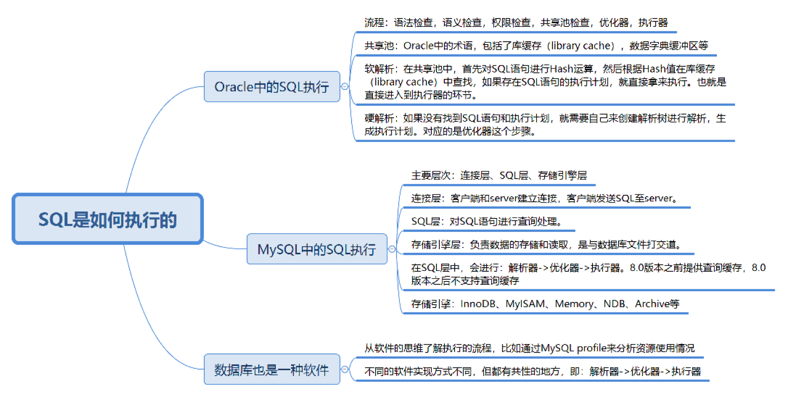
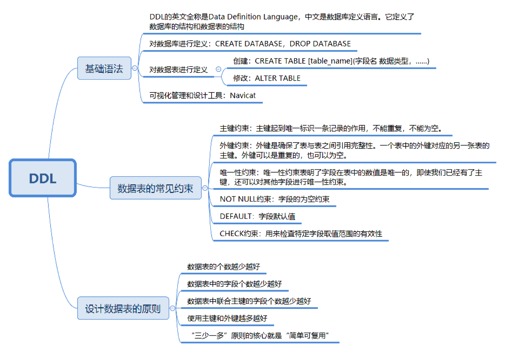
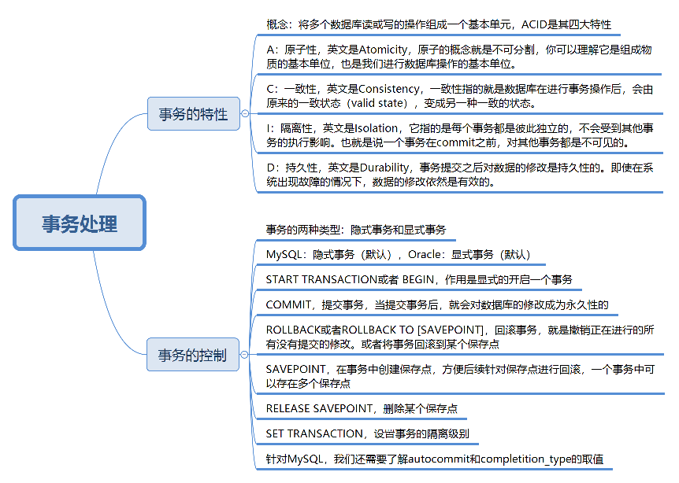

# 极客时间《SQL必知必会》笔记

# 3. SQL执行
Oracle和MySQL都是通过解析器→优化器→执行器这样的流程来执行SQL的。

但Oracle和MySQL在进行SQL的查询上面有软件实现层面的差异。Oracle提出了共享池的概念，通过共享池来判断是进行软解析，还是硬解析。而在MySQL中，8.0以后的版本不再支持查询缓存（缓存查询适用于静态表，当有数据更新时，缓存查询就失效了），而是直接执行解析器→优化器→执行器的流程，这一点从MySQL中的show profile里也能看到。同时MySQL的一大特色就是提供了各种存储引擎以供选择，不同的存储引擎有各自的使用场景，我们可以针对每张表选择适合的存储引擎，MySQL 5.5版本之后默认的存储引擎是InnoDB,它最大的特点是支持事务、行级锁定、外键约束等，MySQL 5.5版本之前是不支持事务的MyISAM引擎。

## 总结


# 4. DDL

DDL的英文全称是Data Definition Language，中文是数据定义语言。它定义了数据库的结构和数据表的结构。常用的功能是增删改，分别对应的命令是CREATE、DROP和ALTER。

`注意` 语句最后以分号（;）作为结束符,为了避免数据表和字段名称与MySQL保留字段相同，需对它们都加上`反引号`



# 5. SELECT检索数据
其中你需要记住SELECT查询时的两个顺序：

1.关键字的顺序是不能颠倒的：

> SELECT ... FROM ... WHERE ... GROUP BY ... HAVING ... ORDER BY ...

2.SELECT语句的执行顺序（在MySQL和Oracle中，SELECT执行顺序基本相同）：

> FROM > WHERE > GROUP BY > HAVING > SELECT的字段 > DISTINCT > ORDER BY > LIMIT

比如你写了一个SQL语句，那么它的关键字顺序和执行顺序是下面这样的：
```
SELECT DISTINCT player_id, player_name, count(*) as num #顺序5
FROM player JOIN team ON player.team_id = team.team_id #顺序1
WHERE height > 1.80 #顺序2
GROUP BY player.team_id #顺序3
HAVING num > 2 #顺序4
ORDER BY num DESC #顺序6
LIMIT 2 #顺序7
```
在SELECT语句执行这些步骤的时候，每个步骤都会产生一个`虚拟表`，然后将这个虚拟表传入下一个步骤中作为输入。需要注意的是，这些步骤隐含在SQL的执行过程中，对于我们来说是不可见的。

## 总结


## 练习
1. 创建王者荣耀表结构（表名hero，主键`id`自增不为NULL 11位int 采用BTREE索引，`name` varchar（255） 不为NULL utf8编码 大小写不敏感，`hp_max` float类型（六位有效，小数点保留两位） 不为NULL）
2. 插入英雄（夏侯惇 `id`=10000 `name`=夏侯惇 `hp_max`=7350）
3. 查询表的所有信息，查询英雄的`id`和`name`
4. 查询heros表，结果取别名，name -> n
5. 结果加入固定列platform->王者荣耀
6. `attack_range`去重，`attack_range`去重带`name`（`注意` DISTINCT需在列名最前方）
7. 显示`name`及`hp_max `，按照第一排序`mp_max`从低到高，当最大法力值相等的时候则按照第二排序进行，即`hp_max`从高到低的方式进行排序
8. 返回英雄名称及最大生命值，按照最大生命值从高到低排序，返回5条记录即可
```

```
[参考表结构](https://github.com/cystanford/sql_heros_data)
# 06. 数据过滤：SQL数据过滤都有哪些方法？

逻辑运算符中一般来说()优先级最高，其次优先级是AND，然后是OR

## 总结


## 练习
1. 查询所有最大生命值大于6000的英雄
2. 查询所有最大生命值在5399到6811之间的英雄
3. 对heros表中的hp_max字段进行空值检查
4. 筛选最大生命值大于6000，最大法力大于1700的英雄，然后按照最大生命值和最大法力值之和从高到低进行排序
5. 查询最大生命值加最大法力值大于8000的英雄，或者最大生命值大于6000并且最大法力值大于1700的英雄
6. 查询主要定位或者次要定位是法师或是射手的英雄，同时英雄的上线时间不在2016-01-01到2017-01-01之间
7. 查找英雄名中包含“太”字的英雄
8. 查找英雄名除了第一个字以外，包含“太”字的英雄
## 答案
```
# 1
DROP TABLE IF EXISTS `hero`;
CREATE TABLE `hero`
(
    `id`     int(11)                                                 not null auto_increment,
    `name`   varchar(255) character set utf8 collate utf8_general_ci not null,
    `hp_max` float(6, 2)                                             not null,
    primary key (`id`) using btree
) engine = InnoDB;
# 2
INSERT INTO hero VALUES (10000, '夏侯惇', 7350.00);
# 3
SELECT * FROM hero;
SELECT id, name FROM hero;
# 4
SELECT name as n FROM heros;
# 5
SELECT '王者荣耀' as platform, name FROM heros;
# 6
SELECT DISTINCT attack_range FROM heros;
SELECT DISTINCT attack_range, name FROM heros;
# 7
SELECT name, hp_max FROM heros ORDER BY mp_max, hp_max DESC;
# 8
SELECT name, hp_max FROM heros ORDER BY hp_max DESC LIMIT 5;
```
# 7. 什么是SQL函数？为什么使用SQL函数可能会带来问题？
## 内置函数

SELECT ABS(-2)，运行结果为2。  
SELECT MOD(101,3)，运行结果2。  
SELECT ROUND(37.25,1)，运行结果37.3。    
SELECT CONCAT('abc', 123)，运行结果为abc123。  
SELECT LENGTH('你好')，运行结果为6。  
SELECT CHAR_LENGTH('你好')，运行结果为2。  
SELECT LOWER('ABC')，运行结果为abc。  
SELECT UPPER('abc')，运行结果ABC。  
SELECT REPLACE('fabcd', 'abc', 123)，运行结果为f123d。  
SELECT SUBSTRING('fabcd', 1,3)，运行结果为fab。  
SELECT CURRENT_DATE()，运行结果为2019-04-03。  
SELECT CURRENT_TIME()，运行结果为21:26:34。  
SELECT CURRENT_TIMESTAMP()，运行结果为2019-04-03 21:26:34。  
SELECT EXTRACT(YEAR FROM '2019-04-03')，运行结果为2019。  
SELECT DATE('2019-04-01 12:00:05')，运行结果为2019-04-01。  

这里有一个有关命名规范的建议：
1. 关键字和函数名称全部大写；
2. 数据库名、表名、字段名称全部小写；
3. SQL语句必须以分号结尾。

## 总结


## 练习
1. 显示英雄以及他的物攻成长，对应字段为attack_growth，让这个字段精确到小数点后一位
2. 显示英雄最大生命值的最大值，就需要用到MAX函数
3. 显示最大生命值最大的是哪个英雄，以及对应的数值
4. 显示英雄的名字，以及他们的名字字数
5. 提取英雄上线日期（对应字段birthdate）的年份，只显示有上线日期的英雄即可（有些英雄没有上线日期的数据，不需要显示），然后再显示他们的名字和上线日期的年份
6. 找出在2016年10月1日之后上线的所有英雄（`因为很多时候你无法确认birthdate的数据类型是字符串，还是datetime类型，如果你想对日期部分进行比较，那么使用DATE(birthdate)来进行比较是更安全的`）
7. 需要知道在2016年10月1日之后上线英雄的平均最大生命值、平均最大法力和最高物攻最大值
## 答案
```
# 1
SELECT name, ROUND(attack_growth,1) FROM heros;
# 2
SELECT MAX(hp_max) FROM heros;
# 3
SELECT name, hp_max FROM heros WHERE hp_max = (SELECT MAX(hp_max) FROM heros);
# 4
SELECT name, CHAR_LENGTH(name) FROM heros;
# 5
SELECT name, EXTRACT(YEAR FROM birthdate) as birthday FROM heros WHERE birthdate IS NOT NULL;
# 6
SELECT name FROM heros WHERE DATE(birthdate) > 2016-10-1;
# 7
SELECT AVG(hp_max), AVG(mp_max), MAX(attack_max) FROM heros WHERE DATE(birthdate) > 2016-10-1;
```
# 08. 什么是SQL的聚集函数，如何利用它们汇总表的数据？
`聚集函数`，它是对一组数据进行汇总的函数，输入的是一组数据的集合，输出的是单个值。

COUNT、AVG、MAX、MIN等聚集函数会自动忽略值为NULL的数据行

HAVING的作用和WHERE一样，都是起到过滤的作用，只不过WHERE是用于数据行，而HAVING则作用于分组
## 总结


## 练习
1. 查询最大生命值大于6000的英雄数量
2. 查询最大生命值大于6000，且有次要定位的英雄数量
3. 查询射手（主要定位或者次要定位是射手）的最大生命值的最大值是多少
4. 想知道射手（主要定位或者次要定位是射手）的英雄数、平均最大生命值、法力最大值的最大值、攻击最大值的最小值，以及这些英雄总的防御最大值等汇总数据
5. 查询不同的生命最大值的英雄数量是多少
6. 统计不同生命最大值英雄的平均生命最大值，保留小数点后两位
7. 按照英雄的主要定位进行分组，并统计每组的英雄数量
8. 对英雄按照次要定位进行分组，并统计每组英雄的数量（NULL也会被分组）
9. 按照英雄的主要定位、次要定位进行分组，查看这些英雄的数量，并按照这些分组的英雄数量从高到低进行排序
10. 按照英雄的主要定位、次要定位进行分组，并且筛选分组中英雄数量大于5的组，最后按照分组中的英雄数量从高到低进行排序
11. 筛选最大生命值大于6000的英雄，按照主要定位、次要定位进行分组，并且显示分组中英雄数量大于5的分组，按照数量从高到低进行排序 

```
# 1
SELECT COUNT(*) FROM heros WHERE hp_max > 6000;
# 2
SELECT COUNT(*) FROM heros WHERE hp_max > 6000 AND role_assist IS NOT NULL;
# 3
SELECT MAX(hp_max) FROM heros WHERE role_main = '射手' OR role_assist = '射手';
# 4
SELECT COUNT(*), AVG(hp_max), MAX(mp_max), MIN(attack_max), Max(defense_max)
FROM heros WHERE role_main = '射手' OR role_assist = '射手';
# 5
SELECT COUNT(*) FROM heros GROUP BY hp_max;
# 6
SELECT ROUND(AVG(DISTINCT hp_max), 2) FROM heros;
# 7
SELECT role_main, COUNT(*) FROM heros GROUP BY role_main;
# 8
SELECT role_assist, COUNT(*) FROM heros GROUP BY role_assist;
# 9
SELECT role_main, role_assist, COUNT(*) FROM heros GROUP BY role_main, role_assist ORDER BY COUNT(*) DESC;
# 10
SELECT role_main, role_assist, COUNT(*) FROM heros WHERE hp_max > 6000
GROUP BY role_main, role_assist HAVING COUNT(*) > 5 ORDER BY COUNT(*) DESC;
```
# 09. 子查询：子查询的种类都有哪些，如何提高子查询的性能？

从查询结果集中再次进行查询，才能得到想要的结果。这个`查询结果集`就是子查询

IN和EXIST查询效率对比：
> SELECT * FROM A WHERE cc IN (SELECT cc FROM B)  
SELECT * FROM A WHERE EXIST (SELECT cc FROM B WHERE B.cc=A.cc)  
实际上在查询过程中，在我们对cc列建立索引的情况下，我们还需要判断表A和表B的大小。在这里例子当中，表A指的是player表，表B指的是player_score表。如果表A比表B大，那么IN子查询的效率要比EXIST子查询效率高，因为这时B表中如果对cc列进行了索引，那么IN子查询的效率就会比较高。  
同样，如果表A比表B小，那么使用EXIST子查询效率会更高，因为我们可以使用到A表中对cc列的索引，而不用从B中进行cc列的查询。

ANY、ALL关键字必须与一个比较操作符一起使用

## 总结


## 练习
1. 哪个球员的身高最高，最高身高是多少
2. `查找每个球队中大于平均身高（本球队）的球员有哪些，并显示他们的球员姓名、身高以及所在球队ID`
3. `出场过的球员都有哪些，并且显示他们的姓名、球员ID和球队ID（IN和EXIST两种）`
4. 查询球员表中，比印第安纳步行者（对应的team_id为1002）中任何一个球员身高高的球员的信息，并且输出他们的球员ID、球员姓名和球员身高
5. 比印第安纳步行者（对应的team_id为1002）中所有球员身高都高的球员的信息，并且输出球员ID、球员姓名和球员身高
6. 查询每个球队的球员数，也就是对应team这张表，我需要查询相同的team_id在player这张表中所有的球员数量是多少
```
# 1
SELECT player_name, height FROM player WHERE height = (SELECT MAX(height) FROM player);
# 2
SELECT player_name, height, team_id FROM player as a
WHERE a.height > (SELECT AVG(height) FROM player as b WHERE a.team_id = b.team_id);
# 3
SELECT player_name, player_id, team_id FROM player WHERE player_id IN (SELECT player_id FROM player_score);
SELECT player_name, player_id, team_id FROM player WHERE EXISTS((SELECT player_id FROM player_score
WHERE player.player_id = player_score.player_id)) ;
# 4
SELECT player_id, player_name, height FROM player WHERE height > ANY (SELECT height FROM player WHERE team_id = 1002);
# 5
SELECT player_id, player_name, height FROM player WHERE height > ALL (SELECT height FROM player WHERE team_id = 1002);
# 6
SELECT team_name, (SELECT COUNT(*) FROM player WHERE player.team_id = team.team_id) as num FROM team;
```
# 10. 常用的SQL标准有哪些，在SQL92中是如何使用连接的？
# 11. SQL99是如何使用连接的，与SQL92的区别是什么？
需要注意的是，如果我们使用了表的别名，在查询字段中就只能使用别名进行代替，不能使用原有的表名，比如下面的SQL查询就会报错：
```
SELECT player_id, player.team_id, player_name, height, team_name FROM player AS a, team AS b  a, team as b WHERE a.team_id = b.team_id
```

进行外连接的时候，建议采用SQL99标准，这样更适合阅读

## 总结


## 练习
`1. team和player两张表的笛卡尔乘积（SQL92和SQL99两种方式）
2. 用team_id对team和player两张表进行等值连接（SQL92和SQL99两种方式, 以及on、using连接）
3. player表中有身高height字段，如果想要知道每个球员的身高的级别，可以采用非等值连接查询（SQL92和SQL99两种方式）
4. 用team_id对team左连接player（SQL92和SQL99两种方式）
5. 用team_id对team右连接player（SQL92和SQL99两种方式）
6. 查看比布雷克·格里芬高的球员都有谁，以及他们的对应身高（自连接）`
```
# 1
SELECT * FROM team, player; # SQL92
SElECT * FROM team CROSS JOIN player; # SQL99
# 2
SELECT player_id, player.team_id, player_name, height, team_name FROM player, team WHERE player.team_id = team.team_id; # SQL92
SElECT * FROM team JOIN player; # SQL99
# 3
SELECT p.player_name, p.height, h.height_level
FROM player AS p, height_grades AS h
WHERE p.height BETWEEN h.height_lowest AND h.height_highest; # SQL92
SELECT player_id, player.team_id, player_name, height, team_name FROM player JOIN team ON player.team_id = team.team_id;
SELECT player_id, team_id, player_name, height, team_name FROM player JOIN team USING(team_id);
# 4
SELECT * FROM player LEFT JOIN team on player.team_id = team.team_id;
# 5
SELECT * FROM player RIGHT JOIN team on player.team_id = team.team_id;
# 6
SELECT b.player_name, b.height FROM player as a , player as b 
WHERE a.player_name = '布雷克-格里芬' and a.height < b.height;# SQL92
SELECT b.player_name, b.height FROM player as a JOIN player as b 
    ON a.player_name = '布雷克-格里芬' and a.height < b.height;# SQL99
```
# 12. 视图在SQL中的作用是什么，它是怎样工作的？
视图一方面可以帮我们使用表的一部分而不是所有的表，另一方面也可以针对不同的用户制定不同的查询视图。

视图是虚拟表，本身不存储数据，如果想要通过视图对底层数据表的数据进行修改也会受到很多限制，通常我们是把视图用于查询，也就是对SQL查询的一种封装
## 总结

## 练习
1. 查询比NBA球员平均身高高的球员都有哪些，显示他们的球员ID和身高。假设我们给这个视图起个名字player_above_avg_height，那么创建视图
2. 在虚拟表player_above_avg_height的基础上，找到比这个表中的球员平均身高高的球员，作为新的视图player_above_above_avg_height
3. 更新视图player_above_avg_height，增加一个player_name字段
4. 删除以上创建的视图
5. NBA球员和身高等级连接的例子，有两张表，分别为player和height_grades。其中height_grades记录了不同身高对应的身高等级。这里我们可以通过创建视图player_height_grades，来完成球员以及对应身高等级的查询
6. 输出球员姓名和对应的球队，对应格式为player_name(team_name)，就可以使用视图来完成数据格式化的操作
7. 统计每位球员在每场比赛中的二分球、三分球和罚球的得分，可以通过创建视图完成
```

```

# 13. 什么是存储过程，在实际项目中用得多么？

## 总结


## 练习
+ 做一个累加运算，计算1+2+…+n等于多少，我们可以通过参数n来表示想要累加的个数
+ 创建一个存储类型get_hero_scores，用来查询某一类型英雄中的最大的最大生命值，最小的最大魔法值，以及平均最大攻击值
```
# 1
CREATE PROCEDURE add_n(IN n INT)
BEGIN
    DECLARE i INT;
    DECLARE num INT;
    SET i = 1;
    SET num = 0;
    WHILE i <= n
        DO
            SET num = num + i;
            SET i = i + 1;
        end while;
    SELECT num;
end;
CALL add_n(50);
# 2
CREATE PROCEDURE get_core(OUT max_max_hp float, OUT min_max_mp float, OUT avg_max_attack float, IN s varchar(255))
BEGIN
    SELECT MAX(hp_max), MIN(mp_max), AVG(attack_max)
    FROM heros
    WHERE role_main = s
    INTO max_max_hp, min_max_mp, avg_max_attack;
end;
```

# 14. 什么是事务处理，如何使用COMMIT和ROLLBACK进行操作？

MySQL默认自动提交，当然我们可以配置MySQL的参数：

> mysql> set autocommit =0;  //关闭自动提交  
mysql> set autocommit =1;  //开启自动提交


## 总结



# 15. 初识事务隔离：隔离的级别有哪些，它们都解决了哪些异常问题？

事务并发处理时会存在哪些异常情况。SQL-92标准中已经对3种异常情况进行了定义，这些异常情况级别分别为脏读（Dirty Read）、不可重复读（Nnrepeatable Read）和幻读（Phantom Read）：
> 1. 脏读：读到了其他事务还没有提交的数据。  
> 2. 不可重复读：对某数据进行读取，发现两次读取的结果不同，也就是说没有读到相同的内容。这是因为有其他事务对这个数据同时进行了修改或删除。  
> 3. 幻读：事务A根据条件查询得到了N条数据，但此时事务B更改或者增加了M条符合事务A查询条件的数据，这样当事务A再次进行查询的时候发现会有N+M条数据，产生了幻读。


## 总结


# 16. 游标：当我们需要逐条处理数据时，该怎么做？


## 总结


