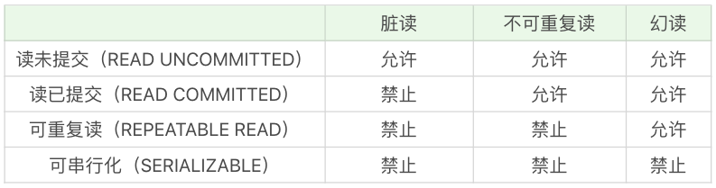

# MySQL

## 事务隔离级别

+ 脏读：读到了其他事务还没有提交的数据。
+ 不可重复读：对某数据进行读取，发现两次读取的结果不同，也就是说没有读到相同的内容。这是因为有其他事务对这个数据同时进行了修改或删除。
+ 幻读：事务 A 根据条件查询得到了 N 条数据，但此时事务 B 更改或者增加了 M 条符合事务 A 查询条件的数据，这样当事务 A 再次进行查询的时候发现会有 N+M 条数据，产生了幻读。

隔离级别从低到高分别是：读未提交（READ UNCOMMITTED ）、读已提交（READ COMMITTED）、可重复读（REPEATABLE READ）和可串行化（SERIALIZABLE）

## 索引

索引相当于一本书的目录，可以帮助我们迅速找到想要的数据。

在数据表中的数据行数比较少的情况下，比如不到 1000 行，是不需要创建索引的。另外，当数据重复度大，比如高于 10% 的时候，也不需要对这个字段使用索引。我之前讲到过，如果是性别这个字段，就不需要对它创建索引。这是为什么呢？如果你想要在 100 万行数据中查找其中的 50 万行（比如性别为男的数据），一旦创建了索引，你需要先访问 50 万次索引，然后再访问 50 万次数据表，这样加起来的开销比不使用索引可能还要大。但是如果在女儿国中查询男子，性别索引就起到作用了。

### 索引的种类

普通索引、唯一索引、主键索引和全文索引

普通索引是基础的索引，没有任何约束，主要用于提高查询效率。唯一索引就是在普通索引的基础上增加了数据唯一性的约束，在一张数据表里可以有多个唯一索引。主键索引在唯一索引的基础上增加了不为空的约束，也就是 NOT NULL+UNIQUE，一张表里最多只有一个主键索引。全文索引用的不多，MySQL 自带的全文索引只支持英文。我们通常可以采用专门的全文搜索引擎，比如 ES(ElasticSearch) 和 Solr。

### 聚集索引和非聚集索引

聚集索引与非聚集索引的原理不同，在使用上也有一些区别：

+ 聚集索引的叶子节点存储的就是我们的数据记录，非聚集索引的叶子节点存储的是数据位置。非聚集索引不会影响数据表的物理存储顺序。
+ 一个表只能有一个聚集索引，因为只能有一种排序存储的方式，但可以有多个非聚集索引，也就是多个索引目录提供数据检索。
+ 使用聚集索引的时候，数据的查询效率高，但如果对数据进行插入，删除，更新等操作，效率会比非聚集索引低。

联合索引需符合最左原则，比如刚才举例的 (x, y, z)，如果查询条件是 WHERE x=1 AND y=2 AND z=3，就可以匹配上联合索引；如果查询条件是 WHERE y=2，就无法匹配上联合索引,这会造成索引失效。

造成索引失效还可能是因为引用LIKE做模糊查询，把%LiKE中%做第一位。索引其实就是排序，或者说排队更直观。

like '张三%'，实际你要找的是'张三XXX'，只要把所有'张三'开头的那部分内容返回即可，这部分是连续的，不需要全表扫描。
like '%张三'，实际你要找的是'XXX张三'，这部分在索引里是不连续的，如果要返回需要的结果，只能全表扫描。

### B+树索引

索引存储在硬盘上，通过索引来查找某行数据的时候，需要计算产生的磁盘 I/O 次数，当磁盘 I/O 次数越多，所消耗的时间也就越大。如果我们能让索引的数据结构尽量减少硬盘的 I/O 操作，所消耗的时间也就越小。树的高度越高，访问磁盘的次数就越多。平衡二叉树（左右子树高度差不超过1）的高度要高于B+树，故数据库索引一般采用B+树。

B+ 树基于 B 树做出了改进，主流的 DBMS 都支持 B+ 树的索引方式，比如 MySQL。B+ 树和 B 树的差异在于以下几点：

+ 有 k 个孩子的节点就有 k 个关键字。也就是孩子数量 = 关键字数，而 B 树中，孩子数量 = 关键字数 +1。
+ 非叶子节点的关键字也会同时存在在子节点中，并且是在子节点中所有关键字的最大（或最小）。
+ 非叶子节点仅用于索引，不保存数据记录，跟记录有关的信息都放在叶子节点中。而 B 树中，非叶子节点既保存索引，也保存数据记录。
+ 所有关键字都在叶子节点出现，叶子节点构成一个有序链表，而且叶子节点本身按照关键字的大小从小到大顺序链接。

### Hash索引

我们之前讲到过 B+ 树索引的结构，Hash 索引结构和 B+ 树的不同，因此在索引使用上也会有差别。

+ Hash 索引不能进行范围查询，而 B+ 树可以。这是因为 Hash 索引指向的数据是无序的，而 B+ 树的叶子节点是个有序的链表。
+ Hash 索引不支持联合索引的最左侧原则（即联合索引的部分索引无法使用），而 B+ 树可以。对于联合索引来说，Hash 索引在计算 Hash 值的时候是将索引键合并后再一起计算 Hash 值，所以不会针对每个索引单独计算 Hash 值。因此如果用到联合索引的一个或者几个索引时，联合索引无法被利用。
+ Hash 索引不支持 ORDER BY 排序，因为 Hash 索引指向的数据是无序的，因此无法起到排序优化的作用，而 B+ 树索引数据是有序的，可以起到对该字段 ORDER BY 排序优化的作用。同理，我们也无法用 Hash 索引进行模糊查询，而 B+ 树使用 LIKE 进行模糊查询的时候，LIKE 后面前模糊查询（比如 % 开头）的话就可以起到优化作用。

## 慢SQL的处理方法

## 联合索引中为什么可以用单独的索引

