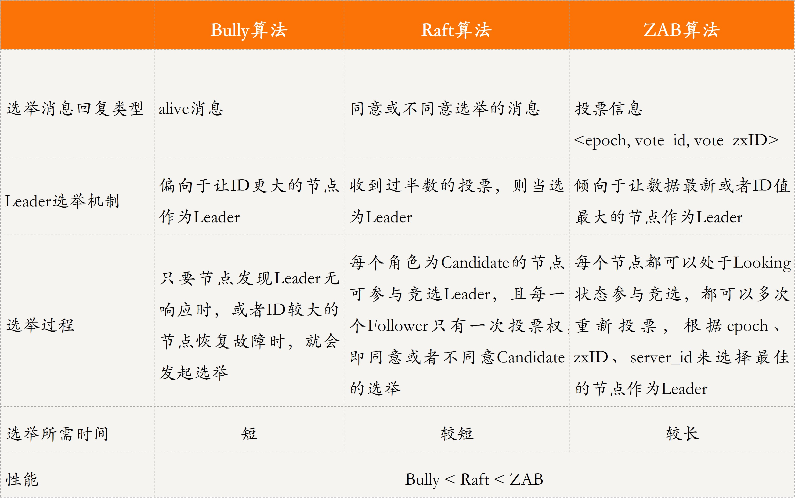

# 1-4

## 1.分布式缘何而起：从单兵，到游击队，到集团军

分布式其实就是将相同或相关的程序运行在多台计算机上，从而实现特定目标的一种计算方式。

从这个定义来看，数据并行、任务并行其实都可以算作是分布式的一种形态。从这些计算方式的演变中不难看出，产生分布式的最主要驱动力量，是我们对于性能、可用性及可扩展性的不懈追求。

在今天这篇文章中，我和你分享了分布式的起源，即从单机模式到数据并行（也叫作数据分布式）模式，再到任务并行（也叫作任务分布式）模式。

单机模式指的是，所有业务和数据均部署到同一台机器上。这种模式的好处是功能、代码和数据集中，便于维护、管理和执行，但计算效率是瓶颈。也就是说单机模式性能受限，也存在单点失效的问题。

数据并行（也叫作数据分布式）模式指的是，对数据进行拆分，利用多台计算机并行执行多个相同任务，通过在相同的时间内完成多个相同任务，从而缩短所有任务的总体执行时间，但对提升单个任务的执行性能及降低时延无效。

任务并行（也叫作任务分布式）模式指的是，单任务拆分成多个子任务，多个子任务并行执行，只要一个复杂任务中的任意子任务的执行时间变短了，那么这个业务的整体执行时间也就变短了。该模式在提高性能、扩展性、可维护性等的同时，也带来了设计上的复杂性问题，比如复杂任务的拆分。

在数据并行和任务并行这两个模式的使用上，用户通常会比较疑惑，到底是采用数据并行还是任务并行呢？一个简单的原则就是：任务执行时间短，数据规模大、类型相同且无依赖，则可采用数据并行；如果任务复杂、执行时间长，且任务可拆分为多个子任务，则考虑任务并行。在实际业务中，通常是这两种模式并用。

## 2.分布式系统的指标：啥是分布式的三围

性能、资源、可用性和可扩展性是分布式系统的重要指标。它们就是分布式系统的“三围”。接下来，我们一起来看看这几个指标吧。

### 性能

常见的性能指标，包括吞吐量（Throughput）、响应时间（Response Time）和完成时间（Turnaround Time）。

常见的吞吐量指标有 QPS（Queries Per Second）、TPS（Transactions Per Second）和 BPS（Bits Per Second）。

响应时间指的是，系统响应一个请求或输入需要花费的时间。响应时间直接影响到用户体验，对于时延敏感的业务非常重要。比如用户搜索导航，特别是用户边开车边搜索的时候，如果响应时间很长，就会直接导致用户走错路。

完成时间指的是，系统真正完成一个请求或处理需要花费的时间。任务并行（也叫作任务分布式）模式出现的其中一个目的，就是缩短整个任务的完成时间。特别是需要计算海量数据或处理大规模任务时，用户对完成时间的感受非常明显。

### 资源占用（Resource Usage）

资源占用指的是，一个系统提供正常能力需要占用的硬件资源，比如 CPU、内存、硬盘等。

### 可用性（Availability）

可用性，通常指的是系统在面对各种异常时可以正确提供服务的能力。可用性是分布式系统的一项重要指标，衡量了系统的鲁棒性，是系统容错能力的体现。

### 可扩展性（Scalability）

可扩展性，指的是分布式系统通过扩展集群机器规模提高系统性能 (吞吐、响应时间、 完成时间)、存储容量、计算能力的特性，是分布式系统的特有性质。

当任务的需求随着具体业务不断提高时，除了升级系统的性能做垂直 / 纵向扩展外，另一个做法就是通过增加机器的方式去水平 / 横向扩展系统规模。

## 3.分布式互斥

在分布式系统里，这种排他性的资源访问方式，叫作分布式互斥（Distributed Mutual Exclusion），而这种被互斥访问的共享资源就叫作临界资源（Critical Resource）。

### 集中式算法

我们引入一个协调者程序，得到一个分布式互斥算法。每个程序在需要访问临界资源时，先给协调者发送一个请求。如果当前没有程序使用这个资源，协调者直接授权请求程序访问；否则，按照先来后到的顺序为请求程序“排一个号”。如果有程序使用完资源，则通知协调者，协调者从“排号”的队列里取出排在最前面的请求，并给它发送授权消息。拿到授权消息的程序，可以直接去访问临界资源。

### 分布式算法

当一个程序要访问临界资源时，先向系统中的其他程序发送一条请求消息，在接收到所有程序返回的同意消息后，才可以访问临界资源。其中，请求消息需要包含所请求的资源、请求者的 ID，以及发起请求的时间。

在大型系统中使用分布式算法，消息数量会随着需要访问临界资源的程序数量呈指数级增加，容易导致高昂的“沟通成本”。

### 令牌环算法

所有程序构成一个环结构，令牌按照顺时针（或逆时针）方向在程序之间传递，收到令牌的程序有权访问临界资源，访问完成后将令牌传送到下一个程序；若该程序不需要访问临界资源，则直接把令牌传送给下一个程序。

## 4.分布式选举

主节点，在一个分布式集群中负责对其他节点的协调和管理，也就是说，其他节点都必须听从主节点的安排。

主节点的存在，就可以保证其他节点的有序运行，以及数据库集群中的写入数据在每个节点上的一致性。这里的一致性是指，数据在每个集群节点中都是一样的，不存在不同的情况。

### 分布式选举的算法

Bully 算法是一种霸道的集群选主算法，为什么说是霸道呢？因为它的选举原则是“长者”为大，即在所有活着的节点中，选取 ID 最大的节点作为主节点。

Raft 算法是典型的多数派投票选举算法，其选举机制与我们日常生活中的民主投票机制类似，核心思想是“少数服从多数”。也就是说，Raft 算法中，获得投票最多的节点成为主。

Raft 算法是典型的多数派投票选举算法，其选举机制与我们日常生活中的民主投票机制类似，核心思想是“少数服从多数”。也就是说，Raft 算法中，获得投票最多的节点成为主。

